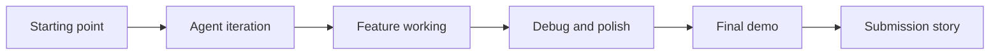
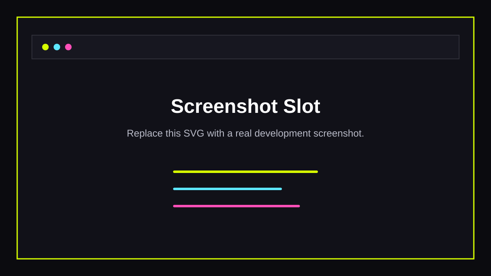

# Screenshot Evidence Board

Use this board as the working map from development screenshots to judging
claims. Each row currently points at `placeholder.svg`; swap in real filenames
as you add screenshots.

## Evidence Flow



## Screenshot Slots

| Slot | Placeholder | What To Replace It With | Judge Criterion |
| --- | --- | --- | --- |
| 01 |  | Starting state at beginning of the build window | Progress in 24 hours |
| 02 |  | First Replit Agent plan, scaffold, or UI draft | Use of Agent |
| 03 |  | Prompt/schema iteration for structured launch outputs | Use of Agent, Execution |
| 04 |  | Async generation job progress working in the app | Execution, Progress |
| 05 |  | Generated image upload/rendering through App Storage | Execution |
| 06 |  | Editing, section regeneration, and undo working | Execution |
| 07 |  | Share/export flow ready for public launch | Execution, Story |
| 08 |  | Final polished workspace or demo result | Progress, Story |

## Caption Template

For each real screenshot, add a short caption in this format:

```text
Filename:
Time or sequence:
What changed:
Agent involvement:
Why it matters to judges:
```

## Before/After Pairing

Use this pairing for the eventual submission page:

| Before | After | Claim |
| --- | --- | --- |
| `01-starting-point-home.png` | `08-final-polish.png` | The app moved from initial build state to a shippable workflow in the build window. |
| `02-first-agent-generated-ui.png` | `06-editor-regeneration-undo.png` | Agent-assisted scaffolding became a real editable product surface. |
| `03-generation-contract-debug.png` | `05-image-storage-working.png` | The AI output contract evolved into validated text plus generated visuals. |
